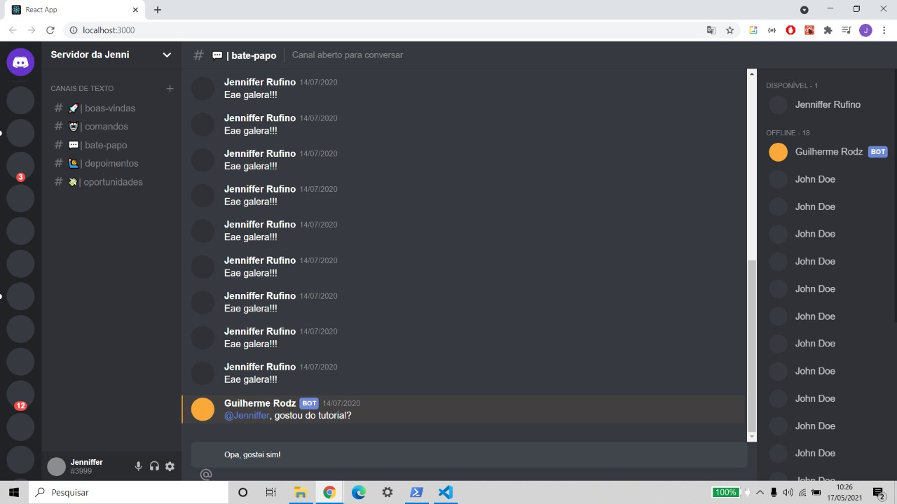

<h3 align="center">Discord Clone!</h3>
<h4 align="center">Este é um clone do Discord.</h4>
<h4 align="center">Este projeto foi feito com o objetivo de aprimorar minhas habilidades com JavaScript e ReactJs.</h4>

    

<h2>🚀 Tecnologias </h2>

Este projeto foi desenvolvido com as seguintes tecnologias:

<ul>
    <li><a href="https://developer.mozilla.org/pt-BR/docs/Web/JavaScript">JavaScript</a></li>
    <li><a href="https://reactjs.org/docs/getting-started.html">React</a></li>
    <li><a href="https://styled-icons.js.org/">Styled Icons</a></li>
    <li><a href="https://styled-components.com/">Styled Components</a></li>
    <li><a href="https://code.visualstudio.com/">Visual Studio Code</a></li>
</ul>

<h2>Confira</h2>

Você pode acompanhar aqui:

<ul>
    <li><a href="#">Discord Clone</a></li>
</ul>

<h2>ℹ️ Como usar</h2>

Para clonar e executar este projeto, você precisará do Git, Node.js + Yarn instalado no seu computador.

Faça o seguinte na sua linha de comando:

    # Clone este repositório
    $ git clone https://github.com/JennifferRufino/discord-reactjs.git 

    # Acesse o repositório
    $ cd discord-reactjs

    # Instale as dependências
    $ yarn

    # Rode o projeto
    $ yarn start

    # O aplicativo da web será aberto na porta: 3000 - Para acessá-lo, vá para http: // localhost: 3000

<h2>👍 Como contribuir</h2>
<ul>
    <li>Faça um fork;</li>
    <li>Crie uma branch com seu recurso: git checkout -b my-feature;</li>
    <li>Confirme as alterações: git commit -m 'feat: My new feature';</li>
    <li>Faça um push para a sua branch: git push origin my-feature.</li>
    <li></li>
</ul>

Feito com ♥ por Jenniffer Rufino 👋 Entre em contato!

